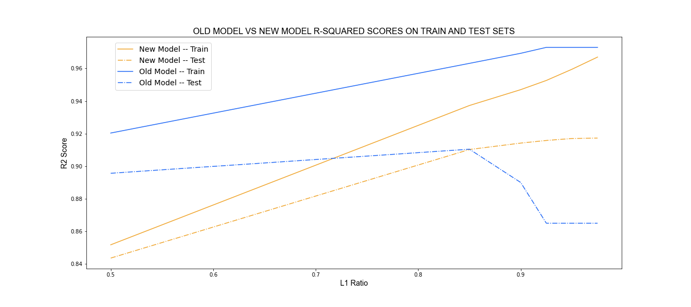

### Problem Statement:

Since the very public failure of Zillow's model driven programatic home buying and selling operation, public faith has been shaken in this new technology driven real estate industrial complex and user participation in online home buying and selling platforms is now at an all time low. A majority of Zillows listing information comes from this user input and from surveys to home buyers, sellers, and agents. Unfortunately, survey response and completion rates are also at an all time low. Low participation risks lowering dataset significance, further weakening model performance and public confidence in real estate modeling.

In response to this crisis, the Ames, Iowa Division of Zillow’s new Survey Task Force, Zill-uh-ow, has asked us in the data science department to determine if reducing survey parameters to their specifications will reduce model performance. The hope is that with less questions and less features to intake information on, there will be increased willingness from users to complete surveys, thereby minimizing undue ongoing distrubance from this public embarassment. 

Zill-uh-ow Team has presented us with a list of 32 parameters determined to be absolutely essential. Superficial research tells us that, of these 32 features, 5 are most essential. 

For this analysis we will look to confirm the importance of these 5 most essential features, and we will create two different models to compare performance of the old model using 79 features with a newer model using only 32 features.

### Data Dictionary:
 
- See provided [data dictionary](http://jse.amstat.org/v19n3/decock/DataDocumentation.txt).

### Analysis:

- Box plot showing that different neighborhoods have both varying distributions, ranges, and heights when it comes to home sale prices.
    

- Scatter plot showing that as home age decreases, home price increases.
- This show positive linear correlation, but also likely logarithmic correlation as well. 
    

- Scatter plot showing that as age of remodeling work decreases, home price increases.
- This show again shows positive linear correlation, but also likely logarithmic correlation as well. 
    

- Scatterplot showing strong heteroscedastic positive correlation between square footage and home price.
- There are two notable outliers with square footage over 4000 sqft. These are eventually removed later for modeling.
    

- Box plot showing that homes with different numbers of bathrooms have both varying distributions, ranges, and heights when it comes to home sale prices.
- Home price appears to increase as number of bathrooms increases up to 3.
    

- Here, 97% (train) of the variability of our target feature is explained in the New Model.
- Here, 97% (train) of the variability of our target feature is explained in the Old Model.
- This scatter plot shows the strong linearity between the predicted and actual values of both models when working with the training data. 
- Both models are performing very well
- This is to be expected.
- There are very few significant outliers.
        

- Here, 92% (test) of the variability of our target feature is explained in the New Model.
- Here, 89% (test) of the variability of our target feature is explained in the Old Model.
- This scatter plot again shows the strong linearity between the predicted and actual values of both models, but instead with the testing data.
- This is less expected.
- Both models are performing well, but the old model shows a number of significant outliers, while the new model shows maybe one. 
- Here, the new model is performing just as well as the old, if not better.
        

- Here, 97% (train) of the variability of our target feature is explained in the New Model.
- Here, 97% (train) of the variability of our target feature is explained in the Old Model.
- This residual plot shows the size of the errors or residual values of the models by predicted value in the training data. 
- Here it is clear that up to $200,000, the models perform excellently, but after this point both models show increasing error and increased heteroscedasticity out away from pure accuracy.
- Despite this departure from homoscedasticity, these errors remains evenly distributed enough that their normalization remains remarkably close to 0.
-Here, the older model appears to show slightly more error than the new model.
        

- Here, 92% (test) of the variability of our target feature is explained in the New Model.
- Here, 89% (test) of the variability of our target feature is explained in the Old Model.
- This residual plot shows the size of the errors or residual values of the models by predicted value in the test data. 
- Here it is clear, again, that up to $200,000, the models perform excellently, but after this point both models show increasing error and increased heteroscedasticity out away from pure accuracy, but nowhere near as much as with the testing data.
- Despite this departure from homoscedasticity, these errors remains evenly distributed enough that their normalization remains remarkably close to 0.
-Here, the older model appears to show slightly more outliers than the new model. 
        

- Here, 97% (train) of the variability of our target feature is explained in the New Model.
- Here, 97% (train) of the variability of our target feature is explained in the Old Model.
- This plot shows the distribution of errors for both models when it comes to making predictions from the training data. 
- The steepness of the distribution confirms the strong performance of both models. 
- Both models appear to perform almost identically, but perhaps the new model performs slightly better. 
        

- Here, 92% (test) of the variability of our target feature is explained in the New Model.
- Here, 89% (test) of the variability of our target feature is explained in the Old Model.
- This plot shows the distribution of errors for both models when it comes to making predictions from the testing data. 
- The hollowness of the old models distribution is strange, as if the bulk of the errors are not quite near zero but not too far from it either. 
- Either way, with a significantly lower peak, the distribution of the new model appears to show that it vastly out performs the old model in terms of returning less error.
        

- Finally this line plot shows the performance of both models as the L1 ratio is increased. 
- Up until an L1 Ratio of .85 both models appear to increase in accuracy, but after this point not so much.
- The new model continues to gradually increase in performance on both training and test data up to a L1 ratio of .975.
- The old models training set performance increases, but its testing set performance drops indicating overfitting.
- Furthermore, the old model failed to converge in a timely manner after an L1 ratio of .925, otherwise these lines may have dropped even further.
- Here, the new model clearly outperforms the older larger weaker model.

 
 
 
 
 

### Conclusion:

This analysis has found that, not only does the newer model with less features perform just as well as the older model with all 79 features, but the newer model actually performs better, explaining 92% of the variability of home sale price. 

Given this information, we assure the Survey Task Force that it makes absolute sense to change the survey, trim the fat, and collect only 32 of the features for hopefully improved survey participation and improved modeling as well. 

 
 
 
 

### Sources:

1. Gomez, Joe. “8 critical factors that influence a home’s value.” Opendoor. March 27, 2019. https://www.opendoor.com/w/blog/factors-that-influence-home-value

2. Ayers, Carla. “8 Factors That Affect Home Value.” ROCKET Homes. December 08, 2021. https://www.rockethomes.com/blog/home-buying/factors-that-influence-homes-value

3. Williams, Dima. “6 Features That Determine a Home's Final Sale Price.” Money. February 6, 2021.https://money.com/how-to-price-a-home/

